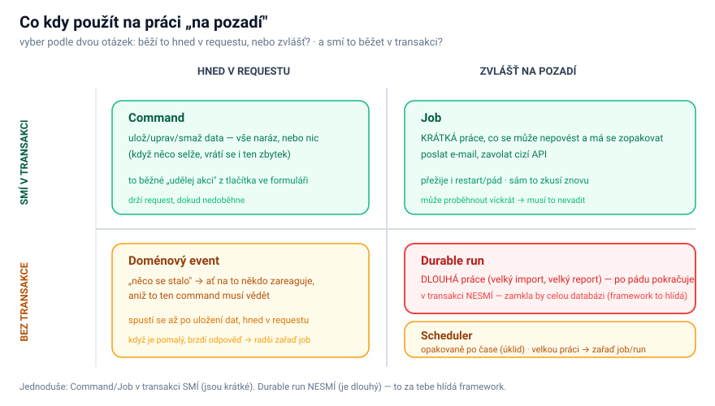

# Background work — co kdy použít

gokick má pět způsobů, jak něco „udělat". Vyber podle dvou otázek: **běží to hned v requestu, nebo zvlášť na pozadí?** a (pro práci na pozadí) **potřebuje to po pádu pokračovat od posledního kroku?** Špatná volba buď ztratí práci (něco, co mělo přežít restart, běželo jen tak), nebo **zamkne celou databázi** (dlouhá práce nebo volání ven v transakci drží zámek na zápis).

> **Job a run jsou jeden engine** (tabulka `runs`, jeden worker) ve dvou tvarech: **job** = fire-and-forget bez checkpointu (`FireAndForget`), **run** = s checkpointem a resume (`Durable`). Oba běží **mimo transakci**. Detailní toky: [Command flow](/framework/command-flow) · [Event flow](/framework/event-flow) · [Job flow](/framework/job-flow) · [Run flow](/framework/run-flow) · [Scheduler flow](/framework/scheduler-flow). Návody: `/gk-commands`, `/gk-domain-events`, `/gk-runs`, `/gk-scheduler`.

## Rychlá volba

- Potřebuješ **uložit/upravit data** v reakci na akci uživatele, **vše naráz nebo nic**? → **command**.
- Chceš, aby na něco **zareagoval někdo další** („stalo se X"), aniž to ten command musí vědět? → **doménový event**.
- Máš background práci, co musí **přežít restart**, ale **nepotřebuje si pamatovat postup** — krátké volání ven (e-mail/SMTP, webhook, jedno API volání) nebo rychlý přepočet? → **job** (fire-and-forget, běží mimo transakci).
- Máš **dlouhou** práci (velký import, velký report), co po pádu **nesmí začít od nuly**? → **durable run** (běží mimo transakci, po každém kroku checkpoint → pokračuje od posledního).
- Chceš něco spouštět **opakovaně po čase** (úklid, synchronizace)? → **scheduler**.

## Přehledová tabulka

| Způsob | Kdy běží | V transakci? | Použij na |
|---|---|---|---|
| **Command** | hned v requestu | ✅ ano | ulož/uprav/smaž data (vše naráz, nebo nic) |
| **Doménový event** | hned po uložení dat | ❌ ne (po uložení) | „stalo se X" → reakce, kterou command nezná |
| **Job** (`FireAndForget`) | zvlášť na pozadí | ❌ **NE** | krátká fire-and-forget práce (mail/API/webhook, přepočet) — **bez checkpointu** |
| **Durable run** (`Durable`) | zvlášť, **dlouho** | ❌ **NE** | dlouhá práce (import, report), co po pádu **pokračuje od posledního kroku** |
| **Scheduler** | opakovaně po čase | ❌ ne | úklid, synchronizace; velkou práci → zařaď job/run |

Job a run se liší jedinou otázkou: **potřebuje to po pádu pokračovat od posledního kroku?** Ano → run (checkpoint), ne → job. Jinak je to ten samý engine.

## Proč „v transakci, nebo ne" tolik záleží

SQLite umí **psát jen z jednoho místa naráz**. Transakce si ten zámek na zápis vezme **hned na začátku** a drží ho až do konce. Z toho plyne jedno tvrdé pravidlo:

> **Uvnitř transakce NIKDY nevolej ven** (síť, e-mail/SMTP, cizí API). Drželo by to zámek na zápis po celou dobu toho volání — SMTP může viset, API request klidně 5 minut → celá databáze mezitím nemůže nic zapsat. Volání ven patří **mimo transakci** (job/run).

- **Command transakci chce** — je **krátký a sahá jen do vlastní DB**. Drží zámek jen chvilku a za to získá jistotu, že se uloží buď všechno, nebo nic.
- **Job i durable run transakci mít nesmějí** — běží na pozadí mimo request a **buď volají ven, nebo trvají dlouho**. Kdyby držely zámek na zápis po dobu volání (job) nebo minuty/hodiny (run), **nikdo jiný by mezitím nemohl nic zapsat** — celá appka by zamrzla. Proto běží mimo transakci; atomicitu „práce + hotovo" nahrazuje **idempotence** (job se po pádu zopakuje, dokončení je samostatný zápis) a u runu navíc **checkpoint** (krátké zápisy postupu mezi kroky).
- **Doménový event** běží **až po uložení dat** (po commitu), takže už není v transakci toho commandu. Běží ale pořád v requestu — **pomalý event brzdí odpověď uživateli**, takže těžkou navazující práci radši **zařaď jako job/run**.
- **Scheduler** běží jen tak na pozadí, bez transakce. Krátký úklid v transakci je v pohodě; **velkou práci zařaď jako job/run**, ať dlouhá transakce nezamkne databázi.

### Že job ani run nesmí otevřít transakci, hlídá framework

Aby background práce omylem nezamkla databázi, je to pravidlo **vynucené**, ne jen napsané (platí pro oba tvary — job i run):

1. **Za běhu** — když se uvnitř handleru někdo pokusí otevřít transakci, **selže to s jasnou chybou** (framework označí ten běh jako „bez transakce" a otevření odmítne).
2. **Při buildu** — test projde kód handlerů a **shodí build**, kdyby tam transakce byla.

Postup tedy run ukládá přes `Checkpointer`; když opravdu potřebuješ něco uložit atomicky, **zařaď na to command** — ten poběží ve své vlastní krátké transakci mimo background práci (job ani run transakci nemají).

## Související

- Toky: [Command flow](/framework/command-flow), [Event flow](/framework/event-flow), [Job flow](/framework/job-flow), [Run flow](/framework/run-flow), [Scheduler flow](/framework/scheduler-flow).
- Skilly: `/gk-commands`, `/gk-domain-events`, `/gk-runs`, `/gk-scheduler`, `/gk-bus`.
