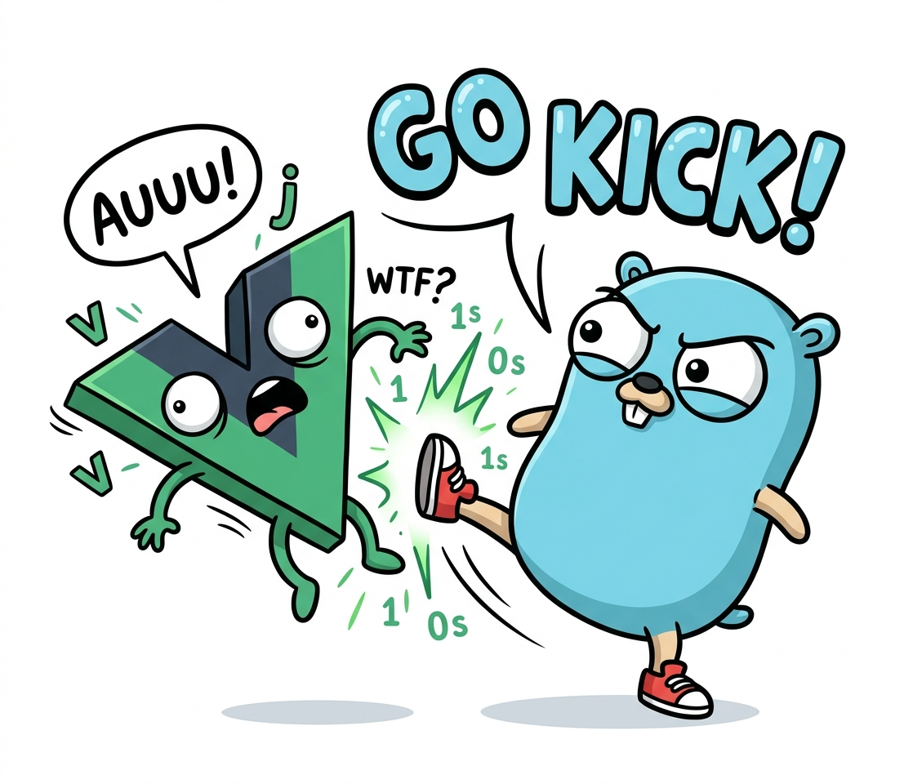

# Roadmap (GoKick)


## 📊 Hodnocení stacku — 8,5 / 10

> **[⬇ Stáhnout PDF report](../gokick-hodnoceni.pdf)** — nezávislý audit reálného kódu.

<a href="../gokick-hodnoceni.pdf"></a>

Boilerplate je **production-ready end-to-end**: DDD/CQRS backend, Vue 3 SPA, JWT auth s HttpOnly refresh cookie a detekcí krádeže, admin user CRUD, perzistentní durable engine + scheduler, rate limiting, audit log, brute-force lock, security headers, Sentry (BE i FE), single-binary deploy. Fáze 1–5 jsou hotové; z F6 je **multitenancy + system bus pro CLI + job↔run konvergence hotové** (OTEL zbývá) — rekapitulace v sekci **Hotovo** níže.

Tenhle dokument je **forward-looking**: co zbývá jako aktuální priorita a co konkrétně chybí do plné desítky v každé disciplíně.


## 🚀 Aktuální priorita — Multitenancy + observabilita (F6)

gokick dostává **zapínatelný multitenancy** a **OpenTelemetry** — obojí je široce přenositelné do dalších projektů, proto patří do jádra, ne dodělávat per-projekt.

### ✅ Multitenancy — HOTOVO ([PR #15](https://github.com/jzaplet/gokick/pull/15))

Zapínatelný **row-level** multitenancy jedním přepínačem (`APP_MULTITENANCY`, default vypnuto = dnešní single-tenant chování) + platformní rovina pro autory aplikace. Detail v **`/gk-multitenancy`** skillu.

- **Izolace:** `tenant_id` (NOT NULL FK) na owned tabulkách; resolver tenant **dodá** (z JWT), repo ho **aplikuje** (`r.Tenant(ctx)`). Bez ORM = žádné transparentní `WHERE`, proto izolaci hlídá **per-dotaz conformance gate** (`zz_tenant_test.go`, padá v CI). Flag vybírá fail-open (chybějící tenant → default) vs fail-closed (panika).
- **Worker propagace:** worker obchází bus, takže tenant jede na `runs` řádku a worker ho obnoví do ctx před handlerem.
- **Platformní rovina:** role `superadmin` + `platform:*` (nad admin/user) — cross-tenant dashboard (počty tenantů/uživatelů), přehled tenantů a uživatelů s cross-tenant správou. Superadmin admin sekci nevidí.
- **Operator tooling:** seed s multitenancy on založí adminovi vlastní tenant; CLI `create-tenant`, `create-superadmin`, `create-user --tenant-id/--tenant-name` (s MT on je tenant povinný).
- **Vědomý strop:** transparentní vynucení (tichý read-leak na slepém místě scanneru) dá až **Postgres RLS** — viz disciplína **Škálovatelnost** níže.

### Krok — System command bus pro CLI ✅ HOTOVO

**Hotovo** přes `bus.SystemCommandBus` (4 commity) — detail v `/gk-bus`. Motivace: čtyři CLI commandy (`seed`, `create-user`, `create-superadmin`, `create-tenant`) obcházely bus a volaly handlery napřímo → **žádný audit, žádná atomická transakce** (orphan-tenant třída chyb, jeden výskyt opraven ručně v `create-user`), žádný strukturovaný log, žádné Sentry při neočekávaném pádu. `create-superadmin` na živém serveru navíc nezanechal **žádnou auditní stopu** — přitom je to nejcitlivější operátorská akce vůbec. Bus se obcházel proto, že `Authorize` i `Tenant` jsou claims-driven (čtou principála/tenant z JWT), a CLI žádný JWT nemá.

Řešení = **system bus levně**: druhý provider `provideSystemCommandBus` poskládá **podmnožinu** stávajících (už composable) middlewarů — žádná nová abstrakce, jen jiný subset:

```
Recovery(→Sentry) → Logging → Audit → DispatchEvents → Transaction      (vynechán Authorize i Tenant)
```

- [x] **`provideSystemCommandBus`** — vynechává `Authorize` (operator trust; kontrakt `Permissioned`/`SkipPermission` žije *uvnitř* AuthorizeMiddleware, takže vynechání je čisté) i `Tenant` (resolver by přemázl tenant injectnutý přes `ContextWithTenantID`). Pořadí: **Audit vně Transaction**, **DispatchEvents obaluje Transaction**. RunDispatcher vynechán.
- [x] **4 commandy přepojeny** přes `bus.ExecVoid`/`bus.Exec` skrz system bus; ruční transakce v `create-user` zmizela (dává ji `TransactionMiddleware`) → odpadl bespoke `shared.Transactor` wiring. **seed** je teď taky přes bus → **atomický bootstrap** (all-or-nothing).
- [x] **Audit záznamy** doplněny: `create-superadmin`/seed superadmin → `user.created`, `create-tenant`/seed tenant → `tenant.created` (bez ActorUserID — systémová akce). Ověřeno end-to-end přes reálný system bus.
- [x] **Sentry = jen neočekávané** — paniky reportuje `RecoveryMiddleware` zadarmo; očekávané validační chyby do trackeru nejdou (invariant „error reporting is for the unexpected only").

### Krok — Sloučit job + durable run do jednoho primitiva

> Nahrazuje původní „konfigurovatelný job lease + heartbeat" — ten cíl (lease + heartbeat pro dlouhou práci) splnil **durable run** ([PR #21](https://github.com/jzaplet/gokick/pull/21)). Zůstával ale dvojí mechanismus: job (handler v transakci → držel write-lock celou dobu, takže „volání ven v jobu" zamrzlo DB a nešlo to vynutit) a run (mimo tx, vynutitelně). **PR #22 ten footgun odstranil sloučením** — job teď běží mimo tx jako run (viz `[x]` níže).

- [x] **Sloučeno do jednoho `durable task`** ([PR #22](https://github.com/jzaplet/gokick/pull/22)) — jeden engine (tabulka `runs`, jeden worker), mimo tx, idempotentní/at-least-once, **volitelný** checkpoint (s checkpointem = run/`Durable`, bez = job/`FireAndForget`), **timeout** per task. „Job" = „task, který necheckpointuješ". Starý job běžel celý v transakci → držel SQLite write-lock po celou dobu, takže „volání ven v jobu" (SMTP/cizí API) zamrzlo DB a nešlo to vynutit; teď job běží **mimo tx** jako run a outside-tx je vynucené (`ContextForbidTx` + `zz_notx_test.go`). Tabulka `jobs` zahozena (`20260629000001_drop_jobs_table.sql`).

### Krok — OpenTelemetry (až na finálním tvaru)

- [ ] **OTel HTTP middleware + propagace přes bus** — `trace_id` v ctx přejde na `trace.SpanContext`, sladit s `shared.LogKeyTraceID` (traces ↔ logy korelují).
- [ ] **Span per durable task** (run worker, `process()` — **bez** transakce: handler běží outside-tx, takže span obaluje běh handleru, ne tx; checkpointy/heartbeaty jako child-spany nebo span-events) + **SQL viditelnost přes `otelsql`** (span per dotaz) — proto se vědomě nestaví vlastní SQL→breadcrumb most. Worker dnes trace_id nemá (logy korelují přes `run_id`); OTEL ho nasadí přes `shared.LogAttrs(ctx)`.
- [ ] **FE↔BE distributed tracing — full** — light verze hotová ([PR #11](https://github.com/jzaplet/gokick/pull/11)); full přidá `tracesSampleRate > 0` → spany + waterfall (FE klik → API → handler → DB).
- [ ] **Hardening:** `otelsql` + OTEL SDK do depguard allow-listu (`.golangci.yml`); collector endpoint do CSP `connect-src` + `traceparent` přes CORS.


## 🔗 BE↔FE typová parita — vynucení „nemáš kam uhnout" (post-audit follow-up)

Dnes generuje `tools/tsgen` TypeScript typy z anotovaných Go DTO (direktiva `//gkts:<TSName> <cesta>` → přesná cílová `.ts` cesta per typ) a `make ts-check` v `make lint` hlídá, že vygenerované soubory nedriftnou. To řeší drift **anotovaných** typů, ale je to **opt-in** — a tím zůstává díra:

- Zapomenu dát `//gkts:` na nový response/request DTO → generátor mlčí.
- Handler odpoví inline `map[string]any` místo pojmenovaného structu → nikdo to nechytí.
- FE `fetch` pošle neotypované `body` nebo zkonzumuje odpověď jako `any` → parita nevynucená.

Generátor umí říct „tenhle typ driftnul", ne „tady jsi typ zapomněl". **Cílový stav = uzavřená smyčka**, kde `//gkts:` na Go DTO je jediný zdroj pravdy a hranice drátu se vynutí staticky:

- [x] **① Codegen (`tools/tsgen`)** — Go DTO → TS, drift = fail v `make lint`. *(hotovo — 13 wire DTO generováno a gate-ováno)*
- [ ] **② BE boundary analyzer** — `go/analysis` linter: každý `response.JSON(w, _, X)` a `request.DecodeJSON(w, r, &X)` musí mít `X` = pojmenovaný struct s `//gkts:`. Inline mapa / `any` / neanotovaný typ = fail. Escape `//gkts:ignore` (stejná disciplína jako raw-pool výjimky) pro debug endpointy. Výsledek: **Go response nejde odeslat mimo generovaný DTO.**
- [ ] **③ FE typovaný fetch + lint** — `authFetch<Res, Req, Err>` s **povinným** `Req` typem; ESLint pravidlo zakáže fetch bez explicitních generovaných typů i inline `body` literál. Výsledek: **fetch nejde poslat mimo generovaný typ.**

② + ③ dohromady = smyčka zavřená: nový handler ani nový fetch nelze přidat bez typu, který existuje a matchuje na obou stranách. Airtight je BE strana (statická jistota); FE je „velmi těsné" (strukturální typing TS), ale v kombinaci s ② nemá FE co poslat mimo deklarovaný kontrakt.

### Sjednocení dev-tooling adresářů

Vedlejší cíl: dnešní roztříštěnost (`cmd/` vs `tools/tsgen` vs `audit/tool`) je matoucí — kam sáhnout, co použít.

- `cmd/` = samotná aplikace (zůstává — to je produkt).
- `audit/tool` = **dočasný** tracker; teardown po dopracování backlogu → zmizí.
- `tools/tsgen` → přejmenovat/rozšířit na **jeden `tools/gk` modul** se sub-příkazy (`ts-gen`, `ts-check`, `boundary-check`). Vlastní `go.mod` je nutnost — codegen píše na stdout i do souborů, což lint invarianty hlavního modulu (jediná logovací cesta) zakazují.
- **Ustálený stav = dva moduly:** `cmd/` (app) + `tools/gk` (dev codegen/checks).
- **Make surface se nemění** — codegen se skládá do `make lint` (drift = fail) a `make build` (regen), takže se vynutí sám; 5 hlavních příkazů v README zůstává jedinou plochou. *„Code-gen, na který si nikdy nevzpomeneš, protože se vynutí sám."*


## Cesta k 10/10

Co konkrétně chybí do plného skóre v jednotlivých disciplínách. **Jedna disciplína nese ~90 % práce** — škálovatelnost; zbytek představují cílené dílčí úpravy v řádu týdnů. Dokumentace & AI skills je na **10/10** (ADRs jsou součástí šablony, ne tohoto projektu — do hodnocení se nepromítají). Detaily a kontext v [PDF reportu](../gokick-hodnoceni.pdf), kapitola 9.

### 🔴 Škálovatelnost `4 → 10` — sem patří většina práce

Největší (a jediný zásadní) strop: single-node SQLite (single-writer) + scheduler bez leader election. **SQLite je přitom vědomá volba, ne nedopatření** — řeší se adaptérem, ne opuštěním návrhu. A protože perzistence sedí za doménovými `Repository` interface, jde o **výměnu adapteru, ne přepis aplikace**. Preferovaná cesta je **adaptér na Postgres** (i transparentní-enforcement endgame pro multitenancy přes **RLS**); alternativně lze zůstat u distribuovaného SQLite. Dvě cesty:

- **A) Zůstat u SQLite (HA + read-scale):**
  - **Turso / libSQL** — embedded replicas + automatický sync, nově i concurrent writes (MVCC, obchází single-writer bottleneck).
  - **rqlite** — Raft, nejzralejší clustering; **dqlite** (Canonical, Raft).
  - LiteFS funguje, ale je pre-1.0 a Fly.io ho deprioritizoval → pro nové projekty spíš Turso.
- **B) Skutečný write-scale (Postgres):**
  - Přidat `infrastructure/postgres/*` + `wire.Bind` na stávající doménové interface (adapter swap).
  - Frontu durable runů nahradit **River** (Postgres-native, battle-tested) místo custom SQLite queue.
  - **Durable runs (`runs` tabulka):** `ClaimDue` na Postgresu přepsat na `SELECT … FOR UPDATE SKIP LOCKED` místo SQLite single-writer + `UPDATE … RETURNING`. **Vedlejší benefit:** současný SQLite `ClaimDue` obaluje indexovaný `run_at` do `julianday()` (kvůli ms-precision korektnosti proti `strftime('%f')` round-half-up skew), takže parciální index `idx_runs_claim` neslouží range-seeku ani ORDER BY → `SCAN` + `TEMP B-TREE` na každém pollu (na cíli ~500 agentů ≈ 6 % stropu, vrací LIMIT 1, takže zatím neřešené). Postgresí seek na nativním `timestamptz` tohle odstraní bez kompromisu na přesnosti. (Nález z xhigh code-review PR #21.)
  - Scheduler ošetřit **leader election** (Postgres advisory locks) — konec double-runů na víc instancích.
  - Rate-limit stav externalizovat (Redis), aby instance byly stateless.

### 🟡 Testovací pokrytí `7,5 → 10`

- **E2E** (Playwright) — chybí browser flow testy.
- **Load testy** (k6 / vegeta) — žádné výkonové stropy nejsou ověřené.
- **Coverage gate** v CI + **contract** a **mutation** testy.

### 🟢 Bezpečnost `9 → 10`

- **2FA** (TOTP) + **WebAuthn**.
- Refresh token na 256-bit; **EdDSA** (asymetrický) JWT pro multi-service nasazení.
- CSP bez `unsafe-inline` (nonce-based); **gosec + CodeQL + govulncheck** v CI; HIBP breach-check hesel.

### 🟢 Architektura `9 → 10`

- Zapojit dnes prázdné **event/run handler registry** reálnými handlery (vzorové příklady).
- Druhý **bounded context** jako referenční vzor (dnes je doména hlavně auth + users).

### 🟢 Výkon `8,5 → 10`

- **Keyset stránkování** všech list dotazů (dnes `FindAll` tahá celou tabulku).
- **Cache vrstva** (in-proc / Redis) pro hot reads.
- **Benchmarky + pprof** profily.

### 🟢 Frontend `8,5 → 10`

- **E2E** (Playwright), **a11y** audit (axe), **i18n**.

### 🟢 Tooling / DX `9,5 → 10`

- **Coverage gate + mutation testing** v CI.
- **Dependabot / Renovate** + govulncheck.
- **SBOM** + podepsané release (cosign) + pre-commit hooky.

## Hotovo (F1–F6)

Rekapitulace — detailní záznam (Definition of Done, regresní testy, klíčová rozhodnutí) je v git historii tohoto souboru.

- **F1 — Event flow & graceful shutdown** (2026-05-17) — request-scoped `EventCollector` (konec race), DispatchEvents přesunut ven z transakce (dispatch až po commitu), SIGTERM drain.
- **F2 — In-process scheduler** (2026-05-17) — cron-like goroutiny s tickerem, run-once-then-tick, panic recovery per-tick; první job: cleanup expirovaných refresh tokenů.
- **F3 — Perzistentní job queue (SQLite)** (2026-05-17) — atomický claim přes `UPDATE … RETURNING`, exponenciální backoff, at-least-once, mark-complete v handler tx, worker pool.
- **F4 — Hardening** (2026-05-17) — 3 kritické fixy z auditu + rate limiting, brute-force lock, audit log mimo transakci, HTTP boundary hardening, SQLite concurrency fix (`_txlock=immediate`).
- **F5 — Observability** — strukturované slog atributy se statickým lint-enforcementem + Sentry BE/FE s obohacením eventu a maskováním tajemství (2026-06-10 / 06-14). OTel je teď součástí fáze **F6** (viz **Aktuální priorita** výše).
- **F6 — Multitenancy (částečně)** — zapínatelný row-level multitenancy + platformní rovina (superadmin) v [PR #15](https://github.com/jzaplet/gokick/pull/15) + system bus pro CLI + job↔run konvergence ([PR #22](https://github.com/jzaplet/gokick/pull/22)); OTEL zbývá (viz **Aktuální priorita**). Detail: `/gk-multitenancy`, `/gk-bus`, `/gk-runs`.
