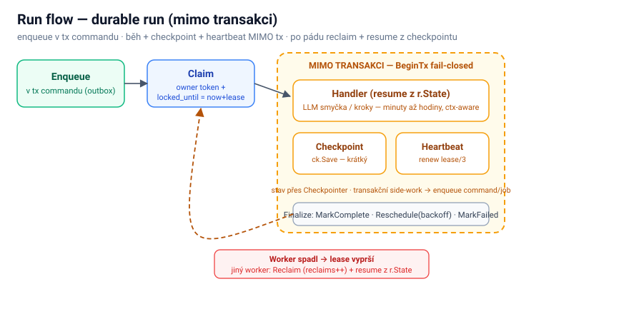

# Run flow

Engine pro **dlouho běžící, resumovatelnou** background práci („agenty"), která běží minuty až hodiny a musí přežít pád procesu **bez ztráty postupu**. Na rozdíl od jobu ([Job flow](/framework/job-flow), krátký job v jedné transakci) běží handler **MIMO transakci**, průběžně **checkpointuje stav** do tabulky `runs`, heartbeat mu drží lease, a když worker umře, jiný worker run **převezme a resumne z posledního checkpointu**. Viz ADR-0001 (durable agent execution model).



> Přehled toku. Návod (run kind, resumovatelný handler, cancel) → `/gk-runs`; kdy run vs job vs scheduler → [Background work](/framework/background-work).


## K čemu to je

Když je práce **dlouhá a musí resumnout** po restartu/pádu (AI agent = LLM smyčka + nástroje, vícekrokový orchestrátor, dlouhý import). Job by nestačil ze dvou důvodů: (1) job běží v jedné transakci, takže dlouhý handler by držel globální SQLite write-lock a **zamkl celou DB**; (2) job nemá průběžný stav, takže pád = běh od nuly. Durable run řeší obojí: **outside-tx běh + checkpoint + lease/heartbeat**.


## Jak to teče

1. **Enqueue** — command handler volá `RunDispatcher.Enqueue(kind, maxRetries, payload)`; INSERT přes `r.Conn(ctx)` se připojí ke **stejné transakci** jako business zápis (atomický enqueue, jako u jobu).
2. **Claim** — worker se ptá fronty a atomicky převezme run jediným `UPDATE … RETURNING`: stampne **owner token** (`locked_by`, per-claim nonce) a `locked_until = now + lease`. Reclaim vypršelého lease bumpne `reclaims` (ne `attempts`).
3. **Mimo transakci** — handler dostane ctx (označený **no-tx**: `BeginTx` v něm selže), `*run.Run` (resume z `r.State`) a `Checkpointer`. Běží **bez transakce**, klidně minuty/hodiny.
4. **Checkpoint** — handler po každém kroku volá `ck.Save(state)`: krátký owner-checked zápis stavu + renew lease. `ErrLeaseLost` = lease ztracen → přestat.
5. **Heartbeat** — vedle běží goroutina, která každý `lease/3` renewuje lease (a sleduje operátorský cancel). Live run se tak nereclaimne.
6. **Finalize** — úspěch → `MarkComplete`; chyba s retry → `Reschedule` (backoff, `attempts++`); vyčerpané retry → `MarkFailed` + report. Run, kterému lease vypršel / byl zrušen → **abandon** (nikdy se necompletuje napůl).
7. **Reclaim + resume** — když worker umře, lease vyprší → jiný worker run **claimne, bumpne `reclaims`, a handler resumne z posledního `r.State`**. Poison-cap (`MaxReclaims`) chrání před crash-loopem.

Stav se odvozuje ze sloupců (`completed_at` / `failed_at` / `cancelled_at` / `locked_until`), žádný `status` enum.


## Příklad

```go
// handler (resumovatelný, idempotentní, ctx-aware, BEZ transakce):
func MyAgent(ctx context.Context, r *run.Run, ck run.Checkpointer) error {
    state := decode(r.State)            // len(State)==0 → od začátku
    for !state.Done {
        out := step(ctx, state)         // LLM / nástroj — mimo tx, ctx zrušitelný
        state = reduce(state, out)
        if err := ck.Save(ctx, encode(state)); err != nil {
            return err                   // ErrLeaseLost → přestat
        }
    }
    return nil
}

// enqueue z command handleru:
shared.RunDispatcherFromContext(ctx).Enqueue(ctx, "agent:summarize", 3, payload)
```

`maxRetries` je povinný. Mimo bus (CLI, testy) je dispatcher no-op. Run handler **nesmí otevřít transakci** (vynuceno — `BeginTx` selže); pro transakční side-work zařaď command/job.


## Související

- [Job flow](/framework/job-flow) — krátký sourozenec (v transakci).
- [Background work](/framework/background-work) — rozhodovací matice + transakční hranice.
- [Command flow](/framework/command-flow) — transakce, ke které se enqueue připojí.
- Skilly: `/gk-runs`, `/gk-jobs`, `/gk-repositories`, `/gk-di`.
- ADR-0001 — durable agent execution model (zatím mimo repo).
